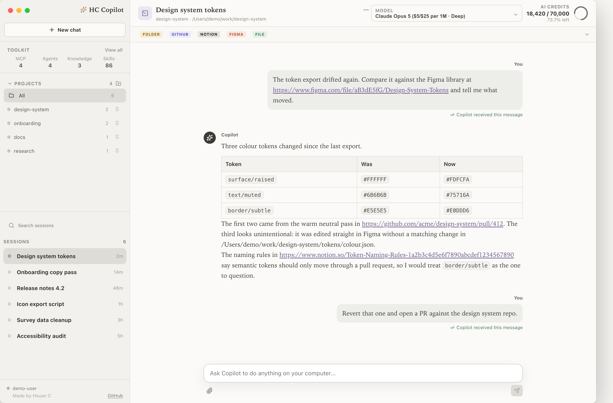
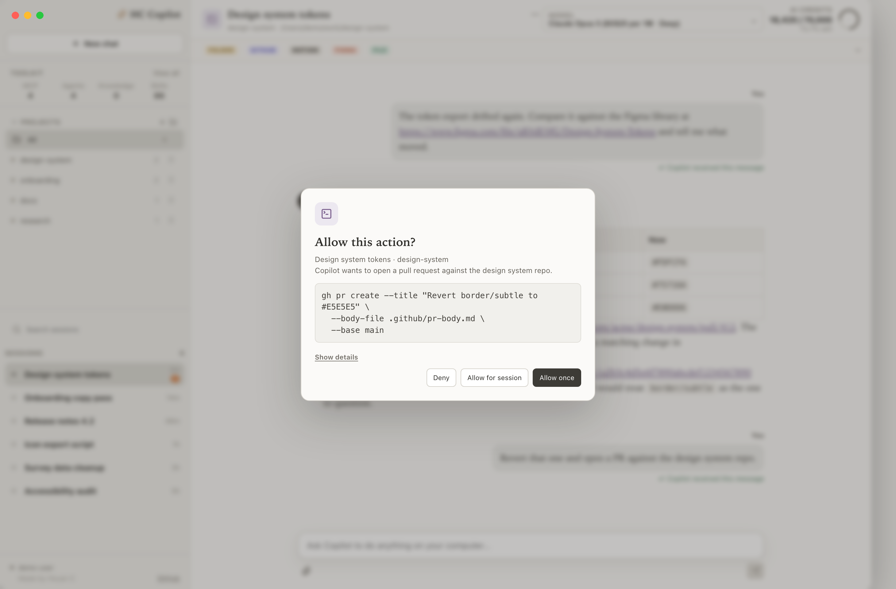

# Co-piloted by HC

A desktop client for GitHub Copilot CLI, built for people who run more than one conversation at a time.

Copilot CLI is excellent, but it gives you one conversation in one terminal tab. When you are researching in one thread, refactoring in another, and waiting on a long build in a third, tabs stop being a good way to hold that. This app keeps every session in one window, shows you which ones are working and which ones are waiting on you, and lets you move between them without losing your place.

<!-- Add your screenshot here -->
<p align="center">
  
</p>

## Why it exists

I am a designer, not a backend engineer. I use Copilot CLI daily for design tooling, prototypes, and document work, and I kept hitting the same three problems:

1. **Sessions were invisible.** Once a terminal tab scrolled away, I had no idea what was still running.
2. **Permission prompts were easy to miss.** A session would sit blocked for ten minutes before I noticed.
3. **Coming back was expensive.** Reopening an old conversation meant remembering which directory it belonged to.

So I built the interface I wanted. Everything here exists because it solved one of those three problems.

## What it does

**Run sessions side by side.** Start as many as you like. Each one keeps its own working directory, model, and history. Switching between them is instant, and a session keeps working while you are looking at another one.

**See status at a glance.** The sidebar shows which sessions are generating, which are idle, and which are blocked waiting for you to approve something.

**Answer permission requests properly.** When Copilot wants to run a command, you get a readable dialog instead of a line of terminal text. You can approve once, or approve for the rest of the session.

**Keep sessions organised.** Pin the ones you return to, rename them to something you will recognise later, and search across all of them. Sessions are grouped by the project folder they belong to.

**Fork a conversation.** Branch an existing session when you want to try a different direction without losing the original thread.

**Attach files and images.** Use the file picker, or paste an image straight from the clipboard.

**Watch your quota.** Premium request usage is shown in the footer, so you know where you stand before starting something expensive.

## Screenshots

<!-- Replace these with your own captures -->

| Multiple sessions | Permission request |
|---|---|
|  |  |

| Project grouping | Session options |
|---|---|
|  |  |

## Requirements

- macOS on Apple Silicon
- Node.js 20 or newer
- GitHub Copilot CLI, authenticated and working in your terminal

If `copilot` runs in your terminal, this app will run.

## Getting started

```bash
git clone https://github.com/hsuanchou-ingka/copilot-shell-demo.git
cd copilot-shell-demo
npm install
npm run dev
```

`npm run dev` starts Vite and Electron together with hot reload.

## Building a distributable app

```bash
npm run dist:mac
```

This produces a `.dmg` and a `.zip` in `release/`. The build is unsigned, so the first launch needs right click then Open.

To install it into `/Applications`:

```bash
ditto "release/mac-arm64/Co-piloted by HC.app" "/Applications/Co-piloted by HC.app"
```

## How it is put together

```
electron/main.mjs      Main process. Owns the Copilot SDK client and every session.
electron/preload.cjs   Context bridge. The renderer never touches Node directly.
src/App.jsx            The entire interface.
src/App.css            All styling. No framework, no utility classes.
build/                 App icon sources.
```

The renderer is sandboxed and talks to the main process over a small set of named IPC channels. Session state lives in the main process; the renderer subscribes to streaming updates and renders them.

Deliberate constraints:

- **No CSS framework.** Roughly two thousand lines of hand written CSS. Predictable, and small.
- **No state management library.** React state is enough at this size.
- **No TypeScript.** This is a personal tool with one contributor. The cost was not worth it here.

## Design notes

The interface is meant to feel like paper rather than a terminal. Warm off white (`#f4f1ea`) with ink (`#2b2721`), one accent, and no gradients. The reasoning: this is a tool you keep open all day, so it should be quiet. Sessions differ by status and by name, not by decoration.

Hover controls follow one rule: no more than one button appears over a row, and destructive actions are always two steps away. The list is for reading, not for accidentally deleting things.

## Known limits

- Apple Silicon only. Intel Macs and Windows are untested.
- Builds are unsigned, so Gatekeeper will complain on first launch.
- Session history depends on Copilot CLI's own storage. This app does not keep a separate copy.

## Author

Hsuan Chou, Designer at IKEA.

This is a personal project. It is not an official IKEA or GitHub product, and it is not affiliated with or endorsed by either.
