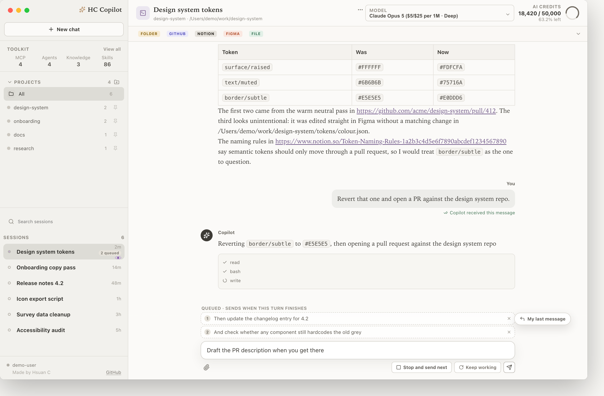
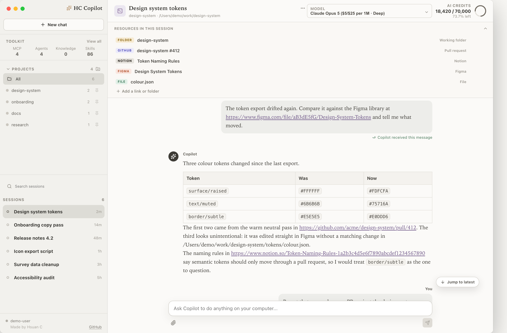
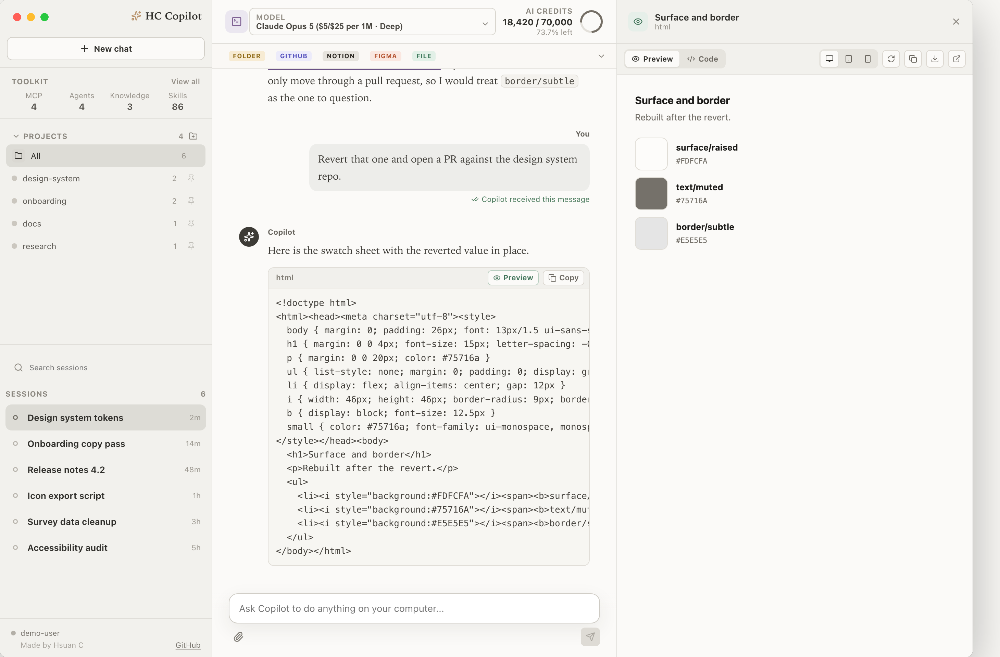
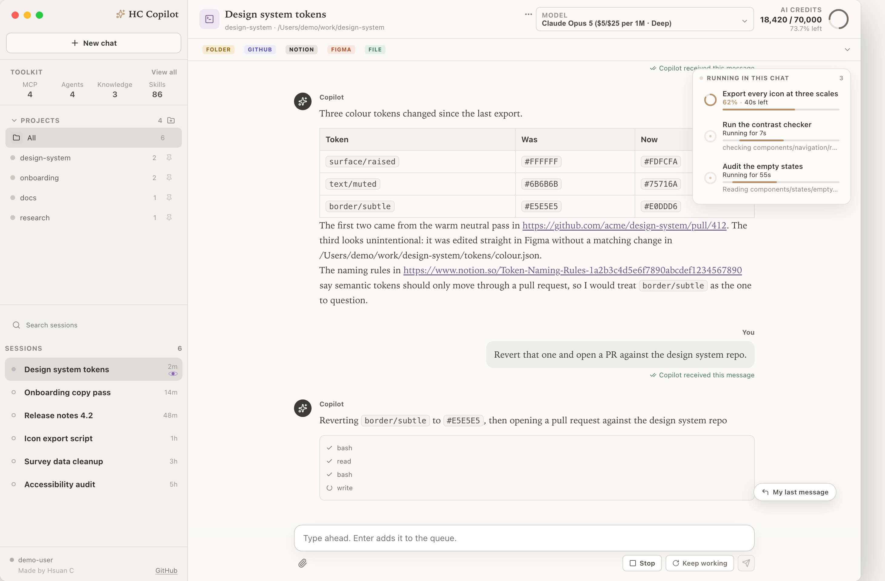

# HC Copilot

A desktop client for GitHub Copilot CLI, built for people who run more than one conversation at a time.

**[Try the live demo](https://hsuanchou-ingka.github.io/copilot-shell-demo/)**, made up data, runs in your browser, includes a short tour.


## Why it exists

I am a designer, not a backend engineer. I use Copilot CLI daily for design tooling, prototypes, and document work, and I kept hitting the same three problems:

1. **Sessions were invisible.** Once a terminal tab scrolled away, I had no idea what was still running.
2. **Permission prompts were easy to miss.** A session would sit blocked for ten minutes before I noticed.
3. **Coming back was expensive.** Reopening an old conversation meant remembering which directory it belonged to.

So I built the interface I wanted. Everything here exists because it solved one of those three problems.

## What it does

**Run sessions side by side.** Start as many as you like. Each one keeps its own working directory, model, and history. Switching between them is instant, and a session keeps working while you are looking at another one.

**See status at a glance.** The sidebar shows which sessions are generating, which are idle, and which are blocked waiting for you to approve something.

**Automatic approvals.** This personal build automatically approves Copilot file and command operations for the session, as configured by its owner.

**Keep sessions organised.** Pin the ones you return to, rename them to something you will recognise later, and search across all of them. Sessions are grouped by the project folder they belong to.

**Fork a conversation.** Branch an existing session when you want to try a different direction without losing the original thread.

**Attach files and images.** Use the file picker, or paste an image straight from the clipboard.

**Type ahead while a turn is running.** You do not have to wait for an answer before writing the next message. Anything you send while the session is busy joins a queue and goes out as soon as the turn finishes, in the order you wrote it.

**Find your way back to the things a session touched.** A rail under the header collects the folders, repositories, Notion pages and Figma files that came up in the conversation, and keeps one entry per kind so it stays a shortcut rather than an index. You can rename, hide or add entries by hand.

**Preview what gets generated.** HTML, SVG and Mermaid blocks render in a resizable panel next to the conversation, with reload, copy, and open in browser. Runtime errors inside the preview are reported back instead of failing silently.

**Keep an eye on long jobs.** Commands you leave running in the background appear in their own list with a progress ring and an estimated finish time, read from the output of tools that report progress.

**Watch your quota.** Premium request usage is shown in the footer, so you know where you stand before starting something expensive.

## A closer look

**Type ahead while a turn is running.** Queued messages sit above the composer in the order you wrote them, and each one can be dropped before it sends.



**The resource rail.** One entry per kind, so it stays a way back to the thing rather than a list of everything mentioned.



**Artifact previews.** Generated markup renders beside the conversation at desktop, tablet or phone width.



**Background jobs.** Detached commands report progress and an estimated finish time without taking over the conversation.



**Permission dialog demo.** The screenshot below shows the dialog component. This personal build currently uses automatic session approvals.


## Install

You need macOS on Apple Silicon, and the GitHub CLI (`gh`) installed and logged in with a GitHub account that has Copilot access. The app talks to Copilot through a bundled SDK, no separate Copilot CLI install needed.

1. Install `gh`, then run `gh auth login` and sign in.
2. Download the zip from the [Releases page](https://github.com/hsuanchou-ingka/copilot-shell-demo/releases/latest).
3. Unzip it, then drag `HC Copilot.app` into Applications.
4. The build is unsigned, so run this once in Terminal: `xattr -cr "/Applications/HC Copilot.app"`
5. Open HC Copilot from Applications.

**Troubleshooting**

- **App is damaged or cannot be opened:** re-run the `xattr` command above against the app in `/Applications`.
- **GitHub CLI is not logged in:** run `gh auth login`, then reopen the app.
- **Multiple `gh` accounts:** the app uses the active one. Run `gh auth switch` to pick the account with Copilot access, then reopen the app.
- Logs are at `~/Library/Application Support/HC Copilot/app.log`.

## Run from source

```bash
git clone https://github.com/hsuanchou-ingka/copilot-shell-demo.git
cd copilot-shell-demo
npm install
npm run dev
```

`npm run dev` starts Vite and Electron together with hot reload. `npm run dist:mac` builds a `.dmg` and a `.zip` in `release/`. `npm run build:demo` builds the browser demo.

Before sending a change, run the checks:

```bash
npm test
npm run lint
npm run build
```

## How it is put together

```
electron/main.mjs      Main process. Owns the Copilot SDK client and every session.
electron/preload.cjs   Context bridge. The renderer never touches Node directly.
src/App.jsx            The entire interface.
src/App.css            All styling. No framework, no utility classes.
build/                 App icon sources.
```

The renderer uses context isolation with Node integration disabled and talks to the main process over named IPC channels. IPC accepts only the app entry page in the main window. Artifact previews run in a sandboxed iframe. Session state lives in the main process; the renderer subscribes to streaming updates and renders them.

Deliberate constraints:

- **No CSS framework.** Roughly two thousand lines of hand written CSS. Predictable, and small.
- **No state management library.** React state is enough at this size.
- **No TypeScript.** This is a personal tool with one contributor. The cost was not worth it here.

## Design notes

The interface is meant to feel like paper rather than a terminal. Warm off white (`#f4f1ea`) with ink (`#2b2721`), one accent, and no gradients. The reasoning: this is a tool you keep open all day, so it should be quiet. Sessions differ by status and by name, not by decoration.

Hover controls follow one rule: no more than one button appears over a row, and destructive actions are always two steps away. The list is for reading, not for accidentally deleting things.

## Known limits

- Apple Silicon only. Intel Macs and Windows are untested.
- Builds are unsigned, so Gatekeeper will complain on first launch.
- Session history depends on Copilot CLI's own storage. This app does not keep a separate copy.

## Author

Hsuan Chou, Designer at IKEA.

This is a personal project. It is not an official IKEA or GitHub product, and it is not affiliated with or endorsed by either.
