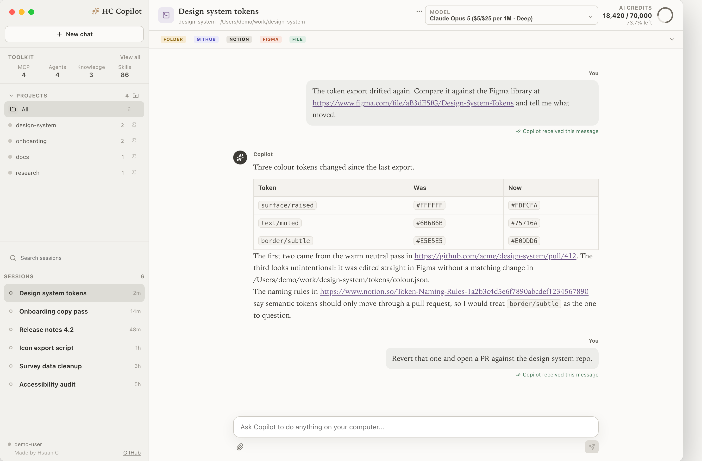
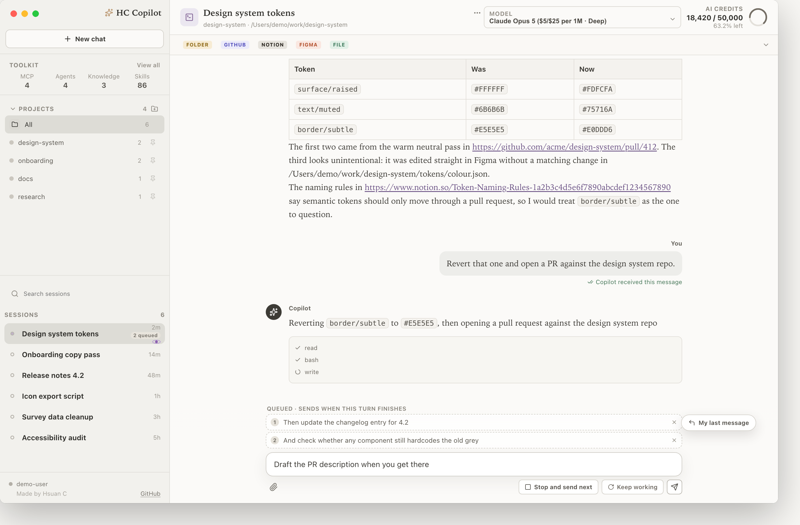
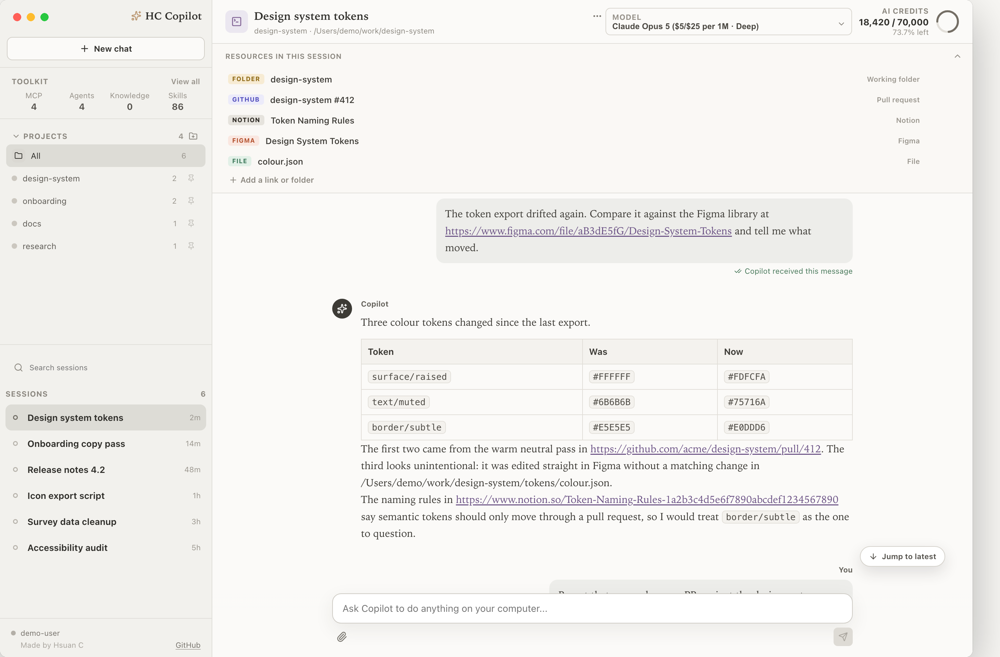
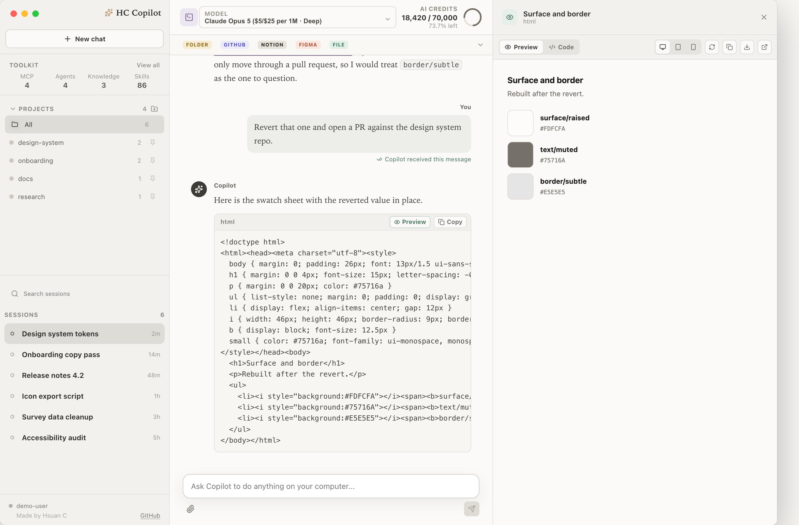
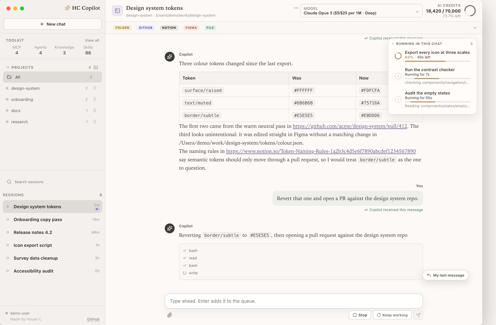
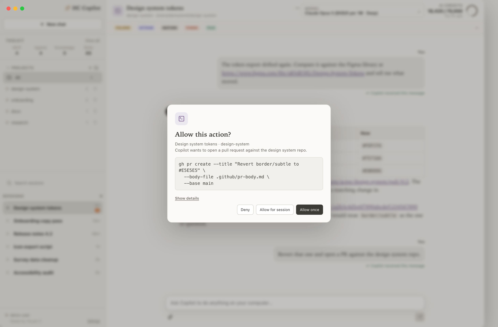

# HC Copilot

A desktop client for GitHub Copilot CLI, built for people who run more than one conversation at a time.

**[Try the live demo](https://hsuanchou-ingka.github.io/copilot-shell-demo/)**, made up data, runs in your browser, includes a short tour.



## Why it exists

I am a designer, not a backend engineer. I use Copilot CLI daily for design tooling, prototypes, and document work, and I kept hitting the same three problems:

1. **Sessions were invisible.** Once a terminal tab scrolled away, I had no idea what was still running.
2. **Permission prompts were easy to miss.** A session would sit blocked for ten minutes before I noticed.
3. **Coming back was expensive.** Reopening an old conversation meant remembering which directory it belonged to.

So I built the interface I wanted. Everything here exists because it solved one of those three problems.

## What it does

**Run sessions side by side.** Start as many as you like. Each one keeps its own working directory, model, and history. Switching between them is instant, and a session keeps working while you are looking at another one.

**See status at a glance.** The sidebar shows which sessions are generating, which are idle, and which are blocked waiting for you to approve something.

**Automatic approvals.** This personal build automatically approves Copilot file and command operations for the session, as configured by its owner.

**Keep sessions organised.** Pin the ones you return to, rename them to something you will recognise later, and search across all of them. Sessions are grouped by the project folder they belong to.

**Fork a conversation.** Branch an existing session when you want to try a different direction without losing the original thread.

**Attach files and images.** Use the file picker, or paste an image straight from the clipboard.

**Work with your existing Chrome tabs.** An optional Playwright MCP connection can read pages, follow links, and fill forms using your browser's existing login state. It requires the official Playwright Extension and local setup; it is not available in the browser demo. The authentication token stays in macOS Keychain rather than the MCP configuration. See [Browser connection](#browser-connection).

**Type ahead while a turn is running.** You do not have to wait for an answer before writing the next message. Anything you send while the session is busy joins a queue and goes out as soon as the turn finishes, in the order you wrote it.

**Find your way back to the things a session touched.** A rail under the header collects the folders, repositories, Notion pages and Figma files that came up in the conversation, and keeps one entry per kind so it stays a shortcut rather than an index. You can rename, hide or add entries by hand.

**Preview what gets generated.** HTML, SVG and Mermaid blocks render in a resizable panel next to the conversation, with reload, copy, and open in browser. Runtime errors inside the preview are reported back instead of failing silently.

**Keep an eye on long jobs.** Commands you leave running in the background appear in their own list with a progress ring and an estimated finish time, read from the output of tools that report progress.

**Watch your quota.** Premium request usage is shown in the footer, so you know where you stand before starting something expensive.

## A closer look

**Type ahead while a turn is running.** Queued messages sit above the composer in the order you wrote them, and each one can be dropped before it sends.



**The resource rail.** One entry per kind, so it stays a way back to the thing rather than a list of everything mentioned.



**Links to things on your machine.** A link in a reply that points at a file or folder opens it in the app macOS would use, whether it is written as an absolute path, a `file://` URL, a `~` path or a path relative to the chat's folder. Spaces and non-Latin names are handled, and a link that points at nothing says which path it looked for. The browser demo has no disk access, so there it says so instead of pretending the file opened.

**Artifact previews.** Generated markup renders beside the conversation at desktop, tablet or phone width.



**Background jobs.** Detached commands report progress and an estimated finish time without taking over the conversation.



**Permission dialog demo.** The screenshot below shows the dialog component. This personal build currently uses automatic session approvals.



## Install

You need macOS on Apple Silicon, and the GitHub CLI (`gh`) installed and logged in with a GitHub account that has Copilot access. The app talks to Copilot through a bundled SDK, no separate Copilot CLI install needed.

1. Install `gh`, then run `gh auth login` and sign in.
2. Download the zip from the [Releases page](https://github.com/hsuanchou-ingka/copilot-shell-demo/releases/latest).
3. Unzip it, then drag `HC Copilot.app` into Applications.
4. The build is unsigned, so run this once in Terminal: `xattr -cr "/Applications/HC Copilot.app"`
5. Open HC Copilot from Applications.

**Troubleshooting**

- **App is damaged or cannot be opened:** re-run the `xattr` command above against the app in `/Applications`.
- **GitHub CLI is not logged in:** run `gh auth login`, then reopen the app.
- **Multiple `gh` accounts:** the app uses the active one. Run `gh auth switch` to pick the account with Copilot access, then reopen the app.
- Logs are at `~/Library/Application Support/HC Copilot/app.log`.

## Browser connection

**About the connection page:** in extension mode each MCP server process opens one extension connection page and attaches the Chrome debugger, so the "Playwright Extension started debugging" banner stays visible while the connection is live. With the default local server entry, every client that starts the server gets its own process, so several app sessions and CLI runs produce one connection page each. The page is not a stray dialog you can simply close: when the server passes the Keychain token, the connection page itself becomes the tab the assistant controls, and the first navigation turns it into the page you asked for. Closing it while it is the only connected tab ends the connection, and the server answers by opening a fresh connection page. To get a single page instead of one per client, run one shared server as described in [One connection page for every client](#one-connection-page-for-every-client).

Sometimes the thing you want help with is already open in your browser: a page you are reading, a prototype you are reviewing, or a form you need to fill in. Rather than copying everything into the chat or signing in again in a separate browser, you can connect HC Copilot to that tab and tell it what to do.

The connection uses Microsoft's official **Playwright Extension**, a Chrome or Edge browser extension, plus a local Playwright MCP server that exposes browser tools to Copilot. It can read page content, follow links, and fill forms using that browser profile's existing login state. This is an optional integration for the desktop app and Copilot CLI, not a built-in browser or a feature of the web demo. Ordinary Playwright MCP opens a separate browser profile; this setup uses extension mode to connect to your existing browser.

### Install the browser extension

1. Open Chrome or Edge in the profile you normally use for the pages you want Copilot to work with.
2. Open the official [Playwright Extension page](https://chromewebstore.google.com/detail/playwright-extension/mmlmfjhmonkocbjadbfplnigmagldckm).
3. Click **Add to Chrome** (or the equivalent install button in Edge), review the requested permissions, then confirm **Add extension**.
4. Open the browser's Extensions menu, select **Playwright Extension**, and open its status page. Keep it available for the connection setup below.

Installing the extension alone is not enough. Copilot also needs the local MCP server configuration below.

### Connect it to HC Copilot or Copilot CLI

**Requirements:** macOS, Node.js with `npx`, and the extension installed in your intended browser profile. If Node.js is not installed, get the LTS installer from [nodejs.org](https://nodejs.org/en/download), then confirm `node --version` and `npx --version` work in Terminal.

**1. Install the launcher.** Open Terminal, get this repository, and copy its launcher into your local Copilot directory. If you already have the repository, run the commands starting with `mkdir` from its root folder instead:

```bash
git clone https://github.com/hsuanchou-ingka/copilot-shell-demo.git
cd copilot-shell-demo
mkdir -p ~/.copilot/bin
cp scripts/playwright-mcp.sh ~/.copilot/bin/playwright-mcp
chmod 700 ~/.copilot/bin/playwright-mcp
```

You do not need to build the app from source to install this launcher.

**2. Save your connection token securely.** In the extension's status page, copy the value shown for `PLAYWRIGHT_MCP_EXTENSION_TOKEN`. Run the command below, then enter only that value at the password prompt, without the `PLAYWRIGHT_MCP_EXTENSION_TOKEN=` prefix. Terminal may not display characters while you enter it. Do not paste the token into a chat, configuration file, or GitHub:

```bash
security add-generic-password -U \
  -s "copilot-playwright-mcp" \
  -a "PLAYWRIGHT_MCP_EXTENSION_TOKEN" -w
```

**3. Register the browser tools.** Open `~/.copilot/mcp-config.json` in a text editor, creating it if it does not exist. Merge this server entry into its `mcpServers` object, preserving any other servers. If a `playwright` entry already exists, replace only that entry. Replace `YOUR_USERNAME` with your macOS home folder name; run `echo "$HOME"` in Terminal to find the correct absolute path:

```json
{
  "mcpServers": {
    "playwright": {
      "type": "local",
      "command": "/Users/YOUR_USERNAME/.copilot/bin/playwright-mcp",
      "args": [],
      "tools": ["*"],
      "enabled": true
    }
  }
}
```

`"enabled"` controls whether clients launch this server at all. Leave it `true` to keep the browser tools available; set it to `false` if you want the entry registered but dormant.

**4. Reload the connection.** Exit and restart Copilot CLI, or fully quit HC Copilot with **Command + Q** and reopen it. This lets its runtime load the changed configuration. Allow Keychain access if macOS prompts.

### Use it in a conversation

1. Open the page you want help with in the browser profile where you installed the extension.
2. In HC Copilot or Copilot CLI, ask: **"Use Playwright to read my existing browser tab and summarise its main points."**
3. When the extension opens its connection page, select the intended tab. It groups accessible tabs by client; move additional tabs into that client's group if needed. Separate clients have separate groups, so a CLI connection does not automatically expose the same tabs to an app session.
4. Continue with a specific instruction, such as one of the examples below. You do not need to copy the page content into the chat.

| What you want | Example instruction |
| --- | --- |
| Read a page | "Read the page in the connected tab and summarise its main points." |
| Follow a link | "Find the pricing link on this page and open it." |
| Fill a form without submitting | "Fill in the fields using the details I provide, but do not submit the form." |
| Try the connection on a public page | "Open a new tab at example.com, read its heading, and follow the Learn more link." |

A successful connection showing only the extension's **Welcome** page does not mean your ordinary tabs are accessible yet. Select the intended page or add it to the correct client's group before asking Copilot to work with it.

### Privacy and troubleshooting

The launcher retrieves the token from Keychain and passes it only through the MCP process environment. Missing, locked, or empty credentials stop the launcher with an explicit error. This bypasses the extension's connection approval dialog, not the assistant's tool permissions or website confirmations. Browser content exposed to the assistant becomes part of its model context; do not grant access to sensitive pages you do not intend to share. Review actions that submit forms, send messages, or change account settings.

**Troubleshooting:** If only Welcome appears, select an ordinary web page in the connection page or add it to the correct client's tab group. If authentication fails, ensure the extension and Keychain token belong to the same Chrome profile; update the Keychain entry if the token changes. The browser demo cannot access your local Keychain or browser tabs.

### One connection page for every client

By default each client starts its own copy of the server, and each copy opens its own connection page. You can instead run one shared server that every client connects to over HTTP, so the browser is opened once and reused.

**1. Write a server config file**, for example `~/.copilot/playwright-shared.json`:

```json
{
  "extension": true,
  "sharedBrowserContext": true,
  "server": { "port": 8931, "host": "localhost" }
}
```

**2. Start the shared server** in a terminal and leave it running:

```bash
PLAYWRIGHT_MCP_CONFIG="$HOME/.copilot/playwright-shared.json" ~/.copilot/bin/playwright-mcp
```

**3. Point the clients at it** by replacing the `playwright` entry in `~/.copilot/mcp-config.json`:

```json
{
  "mcpServers": {
    "playwright": {
      "type": "http",
      "url": "http://localhost:8931/mcp",
      "tools": ["*"]
    }
  }
}
```

Use `localhost` in the URL. The server checks the `Host` header and answers `Access is only allowed at localhost:8931` if you write `127.0.0.1` instead.

The first client to connect opens one connection page, which becomes the tab it works in. Later clients reuse the same browser and the same tab, and no further connection pages appear. Two limits are worth knowing: the shared browser closes when the last client disconnects, so the next client after that opens a fresh connection page, and all clients share one tab group rather than getting a group each. The `PLAYWRIGHT_MCP_SHARED_BROWSER_CONTEXT` environment variable listed in the Playwright MCP documentation has no effect in version 0.0.83, which is why the setting goes in the config file.

### Turn it off again

1. Set `"enabled": false` on the `playwright` entry in `~/.copilot/mcp-config.json`. Leave every other server untouched.
2. Quit HC Copilot with **Command + Q** and exit any running Copilot CLI session. Configuration changes apply to clients started afterwards, so sessions that are already connected keep their server until they end.
3. Connection pages left over from earlier sessions can be closed like any other tab once their server has stopped. While a server is still connected, closing its connection page ends that connection and the server opens a replacement page, so stop the client first. Removing the Chrome extension and the Keychain entry is optional; with the server disabled the extension stays dormant and nothing connects to it.

## Run from source

```bash
git clone https://github.com/hsuanchou-ingka/copilot-shell-demo.git
cd copilot-shell-demo
npm install
npm run dev
```

`npm run dev` starts Vite and Electron together with hot reload. `npm run dist:mac` builds a `.dmg` and a `.zip` in `release/`. `npm run build:demo` builds the browser demo.

Before sending a change, run the checks:

```bash
npm test
npm run lint
npm run build
```

## How it is put together

```
electron/main.mjs      Main process. Owns the Copilot SDK client and every session.
electron/preload.cjs   Context bridge. The renderer never touches Node directly.
src/App.jsx            The entire interface.
src/App.css            All styling. No framework, no utility classes.
build/                 App icon sources.
```

The renderer uses context isolation with Node integration disabled and talks to the main process over named IPC channels. IPC accepts only the app entry page in the main window. Artifact previews run in a sandboxed iframe. Session state lives in the main process; the renderer subscribes to streaming updates and renders them.

Deliberate constraints:

- **No CSS framework.** Roughly two thousand lines of hand written CSS. Predictable, and small.
- **No state management library.** React state is enough at this size.
- **No TypeScript.** This is a personal tool with one contributor. The cost was not worth it here.

## Design notes

The interface is meant to feel like paper rather than a terminal. Warm off white (`#f4f1ea`) with ink (`#2b2721`), one accent, and no gradients. The reasoning: this is a tool you keep open all day, so it should be quiet. Sessions differ by status and by name, not by decoration.

Hover controls follow one rule: no more than one button appears over a row, and destructive actions are always two steps away. The list is for reading, not for accidentally deleting things.

## Known limits

- Apple Silicon only. Intel Macs and Windows are untested.
- Builds are unsigned, so Gatekeeper will complain on first launch.
- Session history depends on Copilot CLI's own storage. This app does not keep a separate copy.

## Author

Hsuan Chou, Designer at IKEA.

This is a personal project. It is not an official IKEA or GitHub product, and it is not affiliated with or endorsed by either.
